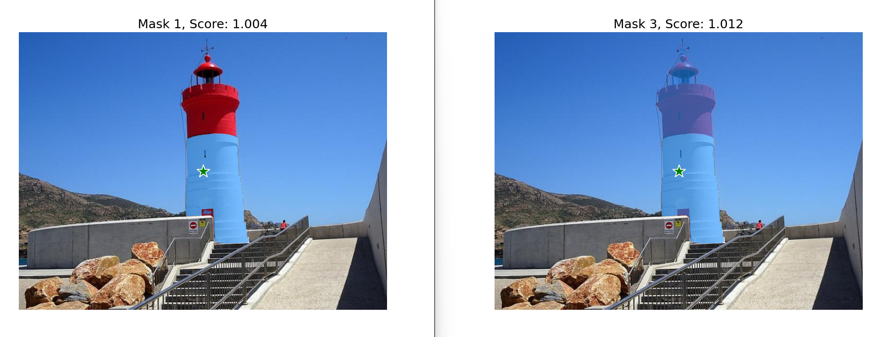

# Segment Anything Model - Mask Generator test

Este proyecto consiste en un script de Python que utiliza la librería SAM de Facebook para segmentar una imagen y generar máscaras que identifican objetos en la imagen. También incluye un nuevo script que utiliza la misma librería para generar máscaras de objetos a partir de un punto de entrada en la imagen.

# Requerimientos:

matplotlib==3.7.1
numpy==1.24.2
opencv_python==4.7.0.72
segment_anything==1.0

Descargar los checkpoints de modelo de la página de GitHub de segment-anything:

https://github.com/facebookresearch/segment-anything#model-checkpoints

# Instrucciones de uso:

## Script de segmentación de objetos
1. Descarga los checkpoints de modelo de la página de GitHub de segment-anything: https://github.com/facebookresearch/segment-anything#model-checkpoints

2. Coloca la imagen que deseas segmentar en la carpeta "image_examples" dentro del directorio donde se encuentra el script.

3. Establece los parámetros deseados en el archivo del script:

- model_size: Tamaño del modelo SAM que deseas utilizar (small, medium o large).
- device: Dispositivo donde se ejecutará el modelo (cuda:0 para GPU o cpu para CPU).
- image_name: Nombre de la imagen que deseas segmentar.

4. Ejecuta el script.

5. El script mostrará la imagen original junto con las máscaras que identifican los objetos en la imagen. También se puede descomentar la sección de código que muestra las máscaras por separado. El tiempo de ejecución se mostrará en la consola.

## Script de generación de máscaras de objetos a partir de un punto de entrada
1. Descarga los checkpoints de modelo de la página de GitHub de segment-anything: https://github.com/facebookresearch/segment-anything#model-checkpoints

2. Coloca la imagen en la que deseas generar la máscara en la carpeta "image_examples" dentro del directorio donde se encuentra el script.

3. Establece los parámetros deseados en el archivo del script:

    model_size: Tamaño del modelo SAM que deseas utilizar (small, medium o large).
    device: Dispositivo donde se ejecutará el modelo (cuda:0 para GPU o cpu para CPU).
    image_name: Nombre de la imagen en la que deseas generar la máscara.
    input_point: Punto de entrada para generar la máscara.
    input_label: Etiqueta para el punto de entrada (1 para objeto, 0 para fondo).
    
4. Ejecuta el script.

5. El script mostrará la imagen original junto con la máscara que identifica el objeto en la imagen en torno al punto de entrada. El tiempo de ejecución se mostrará en la consola.

# License

This project is licensed under the Apache License 2.0. For more information, please refer to the [LICENSE](LICENSE) file in the root of this repository.
Apache License 2.0
Copyright (c) 2023 Alejandro Olivo
